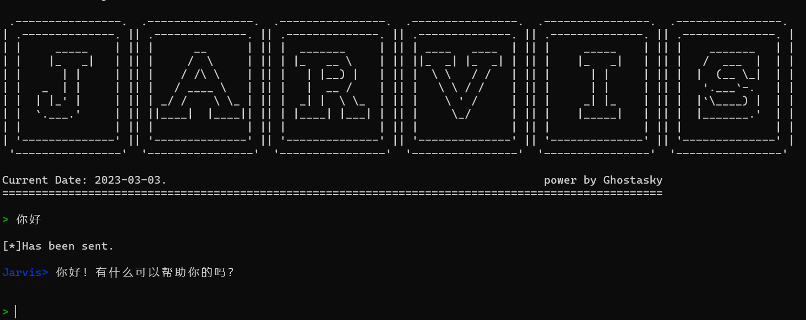

# Jarvis

`Jarvis`一个命令行的ChatGPT。

还有很多不足，更新中......

## 界面

## 安装

使用pip直接安装whl即可

> 可能会出现权限相关的问题，管理员安装即可，待修正

## 使用

第一次运行时要求输入`API key`，会保存到`config.txt`文件中，该文件位于`User\[username]\Jarivs_log\`中

正常使用：输入，按两次回车发送。

## 程序参数

- 显示所有命令 : `/list`, `/?`, `/help`
- 显示所有角色 : `/listR`, `/cr`
- 改变角色: `/change_role`, `/cr`
- 显示历史: `/hisuse`, `/hu`，包含月使用量、余额、用户限额。
- 清屏: `/cls`
  

## 待解决

- 各参数待更新
  - 显示完整prompt
  - 指定gpt版本
  - 修改key
  - 设置临时key
- 权限问题
- 发送历史内容的提取，从而可以使用上下文
- 添加 `google bard`

## Updating

- 日志问题。日志位于`User\[username]\Jarivs_log\`目录中，命名方式为：`2023-xx-xx.txt`
- `2023.4.22 - v0.4.0`: 添加部分参数：显示所有命令，显示所有角色，改变角色
- `2023.5.11 - v0.5.0`: 添加部分参数：显示总使用量
- `2023.5.11 - v0.6.0`: 修复部分参数：增加限额、月余额
- `2023.5.18 - v0.7.0`: 添加流式回答(stream)，每次只发送本轮消息，不发送整个历史消息(省token)。
- `2023.5.19 - v0.8.0`: 添加`cls`清屏指令